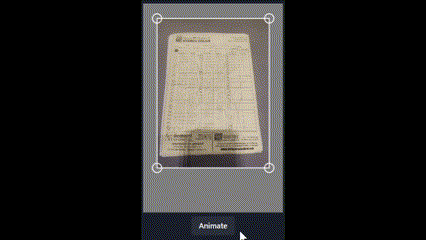

# Use Cropper

> Simple, mobile-friendly, animatable, customizable perspective cropper

 

## Usage

```jsx
import { useCropper } from 'use-cropper'

const { cropper, coords } = useCropper('/path/to/image.png')
// or, for slightly better performance:
const { cropper, getCoords } = useCropper('/path/to/image.png', {lazyCoords: true})

return (
  <div>
    {cropper}
  </div>
)
```

#### Animating
```jsx
const { cropper, animate } = useCropper('/path/to/image.png')
import { fabric } from 'fabric' // optionally, for predefined easing functions

async function runAnimation() {
  await animate({ tl: [0.1, 0.1], tr: [0.9, 0.1] }, { easing: fabric.util.ease.easeOutExpo })
  await new Promise(r => setTimeout(r, 200))
  await animate({ tl: [0, 0], tr: [1, 0] })
}
```
